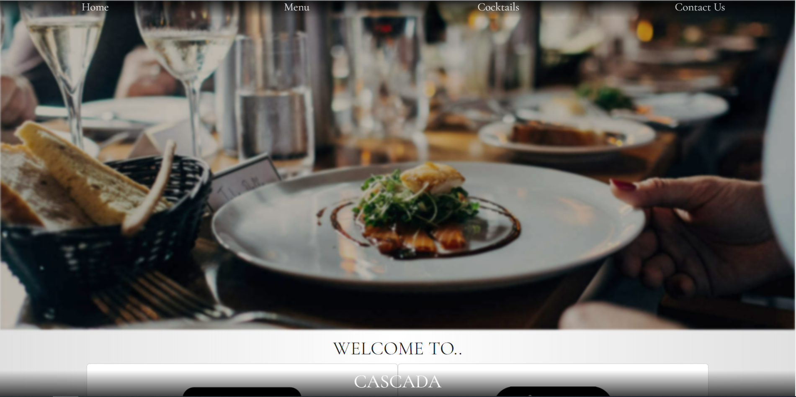
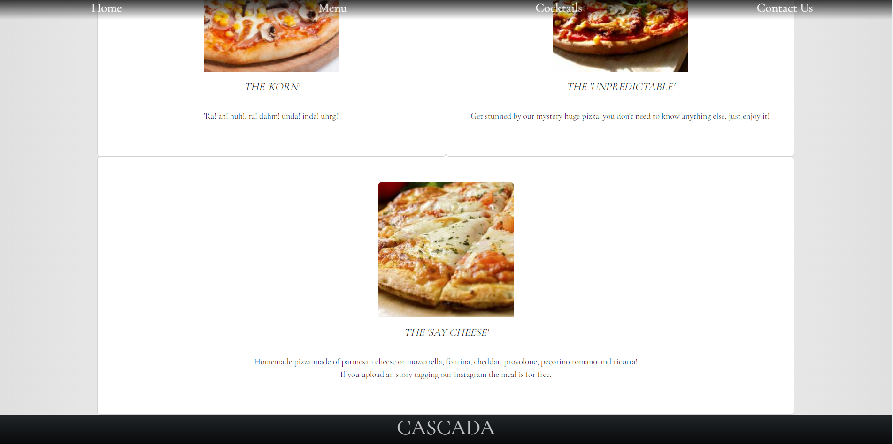

# Cascada Restaurant
***

## General Information

This project is made by HTMl5, CSS and Bootstrap.

We recreated a restaurant's page with his respective Home, Menu, Cocktails and Contact Us pages.
 
The project is responsive in every device.
***
### Appendix

The main theme would be pizzas and cocktails, we also want to add more variety in the future.
***
## Table of content
 [Cascada Restaurant](#cascada-restaurant)

- [General Information](#general-information)   
- [Appendix](#appendix)   
- [Screenshots](#screenshots)   
- [Deployment](#deployment)   
- [Technologies](#technologies-and-library)   
- [Environment Install](#environment-install)   
- [Authors](#authors)   
- [Badges](#badges)   

***
## Screenshots
Computer View:

Responsive Device View (Iphone 12 Pro)

***
## Deployment

https://coquixo.github.io/Carta-Restaurante-fsd-val-Sem2/
***

## Environment Install

-In order to start the project in our device we have to copy this link: "https://github.com/Coquixo/Carta-Restaurante-fsd-val-Sem2.git"

-Then open our console in our IDE, insert "git clone" then paste the link and enter.

-Don't forget to work in the correct directory
***
##  Technologies and library
-   [HTML5](https://html5.org/)
-   [CSS](https://www.w3.org/Style/CSS/Overview.en.html)
-   [Bootstrap](https://getbootstrap.com/)

***
## Authors

- [@Alex López (Github)](https://github.com/Coquixo)
***
## Badges

***
[Back to top](#appendix)